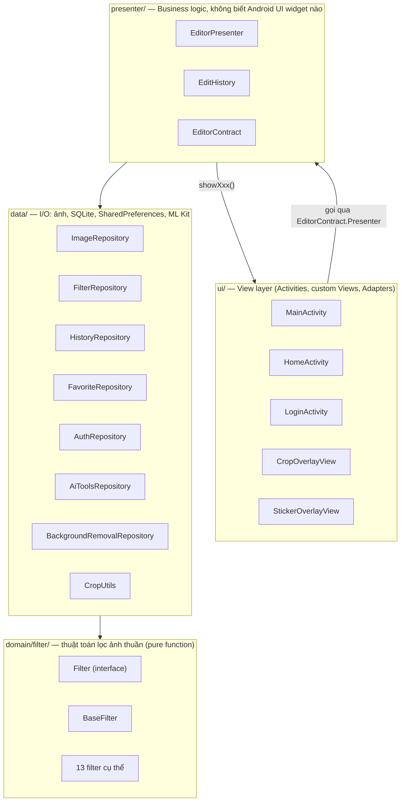
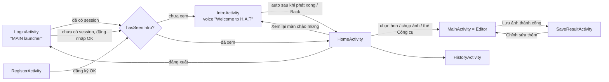
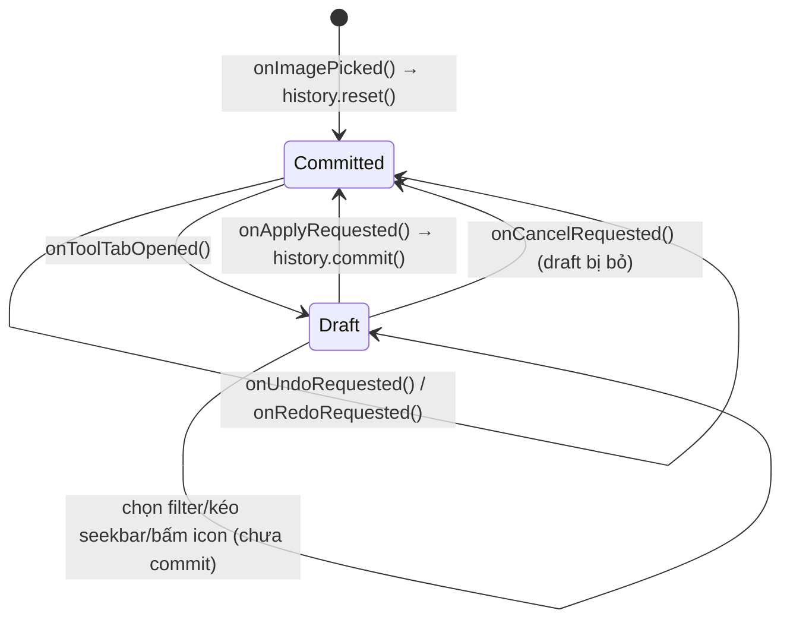

# HATFilter — Tài liệu học code để báo cáo & vấn đáp

> Mục tiêu file này: giúp bạn **hiểu toàn bộ code** của app để tự tin trình bày và trả lời vấn đáp của thầy. Đọc theo thứ tự từ trên xuống — phần đầu là bức tranh tổng thể, càng xuống dưới càng đi sâu vào chi tiết.

---

## Mục lục

1. [Tổng quan ứng dụng](#1-tổng-quan-ứng-dụng)
2. [Công nghệ & thư viện sử dụng](#2-công-nghệ--thư-viện-sử-dụng)
3. [Kiến trúc tổng thể MVP](#3-kiến-trúc-tổng-thể-mvp)
4. [Luồng màn hình (Activity flow)](#4-luồng-màn-hình-activity-flow)
5. [Tầng Domain — bộ lọc ảnh (`domain.filter`)](#5-tầng-domain--bộ-lọc-ảnh-domainfilter)
6. [Tầng Data (`data`)](#6-tầng-data-data)
7. [Tầng Presenter (`presenter`)](#7-tầng-presenter-presenter)
8. [Tầng UI (`ui`)](#8-tầng-ui-ui)
9. [Tính năng theo từng tab của Editor](#9-tính-năng-theo-từng-tab-của-editor)
10. [Cơ chế Undo/Redo + Apply/Cancel (trái tim của Editor)](#10-cơ-chế-undoredo--applycancel-trái-tim-của-editor)
11. [Xử lý bất đồng bộ & vòng đời Bitmap](#11-xử-lý-bất-đồng-bộ--vòng-đời-bitmap)
12. [Tài khoản & bảo mật](#12-tài-khoản--bảo-mật)
13. [Unit test hiện có](#13-unit-test-hiện-có)
14. [Lịch sử phát triển / quy ước git (để hiểu COMMIT_PLAN.md)](#14-lịch-sử-phát-triển--quy-ước-git)
15. [Câu hỏi vấn đáp dự kiến + gợi ý trả lời](#15-câu-hỏi-vấn-đáp-dự-kiến--gợi-ý-trả-lời)

---

## 1. Tổng quan ứng dụng

- **Tên app:** HATFilter (tên hiển thị), package Android: `com.example.photofilter`.
- **Loại app:** chỉnh sửa ảnh trên điện thoại (offline-first, không có backend server — mọi dữ liệu lưu cục bộ trên máy).
- **Chức năng chính:**
  - Đăng ký/Đăng nhập tài khoản cục bộ (không dùng Firebase).
  - Màn chào mừng (Intro) phát giọng nói + hiệu ứng, hiện 1 lần/máy.
  - Màn Home: chọn ảnh từ thư viện, chụp ảnh, mở Công cụ AI nhanh, xem lịch sử, xem "Recent Photos".
  - Màn Editor (`MainActivity`) — trái tim của app — với 5 tab: **Bộ lọc, Cắt, Tuỳ chỉnh, Công cụ, Sticker**.
  - Undo/Redo toàn cục xuyên suốt mọi tab.
  - Lưu ảnh vào thư viện máy (MediaStore) + chia sẻ (Share Intent).
  - Lịch sử các lần lưu ảnh (SQLite).
- **Điểm nhấn kỹ thuật** (những thứ nên nhấn mạnh khi báo cáo):
  1. Kiến trúc **MVP** rõ ràng (tách View khỏi Presenter khỏi Data/Domain).
  2. **Factory/Registry pattern** cho bộ lọc (`FilterRepository`) — thêm filter mới chỉ cần 1 dòng.
  3. **Template Method pattern** (`BaseFilter`) cho tất cả 13 filter.
  4. Xử lý ảnh bằng **`ColorMatrix`** (GPU-accelerated qua `Paint`) cho các phép biến đổi tuyến tính, và xử lý **pixel-array thủ công** (`getPixels`/`setPixels`) cho các phép không tuyến tính (blur, sharpen, median denoise).
  5. Một tính năng dùng **ML thật** (Google ML Kit Selfie Segmentation) để tách nền — phân biệt rõ với các "AI tools" còn lại chỉ là toán học ảnh thuần tuý.
  6. Cơ chế **Draft / Apply / Cancel** + **Undo/Redo** (bounded 15-entry stack, giữ ghim ảnh gốc `pristineOriginal`).
  7. Toàn bộ xử lý ảnh chạy trên **background thread** (`ExecutorService`), đồng bộ về UI qua `Handler` + cơ chế `requestId` để huỷ kết quả cũ (stale-response guard).
  8. SQLite thuần (không Room) cho 3 bảng: favorites, history, users.

---

## 2. Công nghệ & thư viện sử dụng

| Thành phần | Công nghệ |
|---|---|
| Ngôn ngữ | Java |
| Nền tảng | Android (minSdk 24, targetSdk 34, compileSdk 34) |
| Kiến trúc | MVP (Model-View-Presenter) thủ công, không dùng ViewModel/LiveData/Room |
| UI Toolkit | Android Views (XML) + Material Components (`MaterialToolbar`, `BottomSheetBehavior`, `MaterialCardView`) |
| Ảnh | `android.graphics` (`Bitmap`, `Canvas`, `ColorMatrix`, `Matrix`, `Paint`) |
| Load ảnh (thumbnail/preview) | Glide |
| EXIF (xoay ảnh đúng chiều) | `androidx.exifinterface` |
| Lưu ảnh | MediaStore API (`ContentResolver`) |
| Nhận diện chủ thể/tách nền | Google ML Kit — Selfie Segmentation (on-device) |
| Cơ sở dữ liệu cục bộ | SQLite thuần qua `SQLiteOpenHelper` (favorites, history, users) |
| Phiên đăng nhập | `SharedPreferences` |
| Test | JUnit + Robolectric (test Android framework mà không cần emulator) + Mockito |
| Build | Gradle Kotlin DSL (`build.gradle.kts`), Android Gradle Plugin |

Không dùng: Room, Retrofit/network API cho tính năng chính, Firebase, Jetpack Compose, ViewModel/LiveData, Dagger/Hilt, Coroutines/RxJava (chỉ dùng `ExecutorService` + `Handler` thuần).

---

## 3. Kiến trúc tổng thể MVP



**Nguyên tắc MVP trong project này** (rất hay bị hỏi):
- **View** (`MainActivity` implements `EditorContract.View`) — chỉ vẽ UI và forward sự kiện người dùng (click, seekbar...) xuống Presenter. **Không có logic Bitmap nào trong `MainActivity`** ngoại trừ việc tính toán vùng hiển thị ảnh trên màn hình (letterbox bounds) để phục vụ overlay.
- **Presenter** (`EditorPresenter`) — điều phối toàn bộ luồng nghiệp vụ: gọi Data/Domain, quản lý draft, quản lý `EditHistory`, quyết định khi nào gọi lại `view.showXxx(...)`. Presenter **không import bất kỳ Android UI widget nào** (không có `TextView`, `ImageView`...), chỉ dùng `Bitmap`/`Uri`/`Context`.
- **Contract** (`EditorContract`) — interface trung gian định nghĩa đúng 2 phía: `View` (những gì Presenter có thể yêu cầu UI hiển thị) và `Presenter` (những hành động UI có thể gọi). Đây là điểm tách rời quan trọng nhất — nhờ nó, `EditorPresenter` có thể được **unit test hoàn toàn không cần Android thật** (dùng `FakeView` giả lập `EditorContract.View`, xem mục 13).
- **Data** — các Repository, mỗi cái chỉ lo một việc (Single Responsibility): đọc/ghi ảnh, đọc/ghi SQLite, gọi ML Kit...
- **Domain** — các `Filter` là pure function: `Bitmap apply(Bitmap source)`, không side-effect, không phụ thuộc Context.

---

## 4. Luồng màn hình (Activity flow)



- **Điểm vào duy nhất:** `LoginActivity` (khai báo `MAIN`/`LAUNCHER` trong `AndroidManifest.xml`).
- **`AuthRepository.isLoggedIn()`** kiểm tra `SharedPreferences` — nếu đã đăng nhập từ trước thì `LoginActivity` bỏ qua UI, nhảy thẳng luôn (không setContentView).
- **`intro_shown`** là cờ theo **thiết bị** (không theo tài khoản) — nghĩa là dù đăng xuất/đăng nhập tài khoản khác trên cùng máy, màn Intro cũng không hiện lại (trừ khi bấm "Xem lại màn chào mừng").
- **`MainActivity`** nhận `EXTRA_AUTO_ACTION` để Home có thể "bấm 1 phát" là mở luôn ảnh từ thư viện/camera hoặc mở thẳng tab Công cụ sau khi chọn ảnh (`AUTO_ACTION_PICK`, `AUTO_ACTION_CAMERA`, `AUTO_ACTION_PICK_THEN_AI`).
- **Shared element transition:** khi bấm 1 thẻ ở Home, ảnh/card đó "bay" sang `mainImageView` ở `MainActivity` (dùng `ActivityOptionsCompat.makeSceneTransitionAnimation` + `transitionName="editorPhotoCanvas"`).

---

## 5. Tầng Domain — bộ lọc ảnh (`domain.filter`)

### 5.1. `Filter` (interface) + `BaseFilter` (Template Method)

```java
public interface Filter {
    Bitmap apply(Bitmap source); // pure function, không mutate/recycle source
}
```

```java
public abstract class BaseFilter implements Filter {
    public final Bitmap apply(Bitmap source) {
        if (source == null || source.isRecycled()) throw new IllegalArgumentException(...);
        return process(source);           // bước validate dùng chung
    }
    protected abstract Bitmap process(Bitmap source);   // subclass override

    protected final Bitmap applyColorMatrix(Bitmap source, ColorMatrix matrix) {
        // dựng Bitmap mới cùng size, vẽ source lên Canvas với Paint có ColorMatrixColorFilter
    }
}
```

**Đây là Template Method pattern**: `apply()` là "khung" cố định (validate rồi gọi `process()`), còn `process()` là phần "đắp thêm" mà mỗi filter con tự định nghĩa. Filter nào chỉ cần biến đổi màu tuyến tính thì gọi `applyColorMatrix()` có sẵn, khỏi phải tự viết Canvas/Paint.

### 5.2. Danh sách 13 filter — bản chất toán học

| Filter | Kỹ thuật | Ý tưởng |
|---|---|---|
| `OriginalFilter` | ColorMatrix identity | Không đổi gì (matrix đơn vị) |
| `GrayscaleFilter` | `matrix.setSaturation(0)` | Bão hoà = 0 → khử hết màu |
| `NegativeFilter` | Ma trận `-1` mỗi kênh + offset 255 | `output = 255 - input` từng kênh RGB |
| `SepiaFilter` | Ma trận sepia cố định (hệ số chuẩn 0.393/0.769/0.189...) | Pha trộn RGB theo công thức sepia kinh điển |
| `ColorToneFilter` (Ấm/Lạnh) | Cộng/trừ offset ở kênh đỏ và xanh dương (`±30`) | Ấm: +đỏ/−xanh dương; Lạnh: ngược lại |
| `BrightnessContrastFilter` | `output = input*contrast + translate`, `translate = brightness + (1-contrast)*127.5` | Công thức tuyến tính brightness/contrast quanh điểm giữa xám 127.5 |
| `VintageFilter` | `setSaturation(0.7)` + ma trận làm ấm/nhạt màu | Giảm bão hoà + nâng tối thiểu (lifted shadows) + ngả vàng |
| `VignetteFilter` | **Không dùng ColorMatrix** — vẽ `RadialGradient` đen mờ dần từ tâm ra viền lên trên ảnh gốc bằng `Canvas` | Tối 4 góc — vì phụ thuộc **vị trí pixel** nên ColorMatrix (chỉ biến đổi theo kênh màu, không biết toạ độ) không làm được |
| `BlurFilter` | Box blur 2 pass (ngang rồi dọc), thao tác trực tiếp mảng pixel `getPixels()/setPixels()`, bán kính 6 | Cũng là phép phụ thuộc vị trí pixel lân cận → không thể dùng ColorMatrix |
| `FilmFilter` | `setSaturation(0.85)` + ma trận giảm nhẹ từng kênh kèm offset cộng | Tông phim: giảm tương phản, ngả vàng-xanh lá nhẹ |
| `MonoFilter` | `setSaturation(0)` + ma trận tăng tương phản, ngả lạnh nhẹ | Đen trắng tương phản cao — khác `GrayscaleFilter` (thuần desaturate) |
| `RetroFilter` | `setSaturation(1.1)` + ma trận ngả đỏ/hồng, giảm kênh xanh dương | Phong cách retro thập niên 70 |

### 5.3. `ColorAdjustFilter` — bộ điều chỉnh tương tác (tab "Tuỳ chỉnh")

Đây là filter đặc biệt: **không nằm trong `FilterRepository`/danh sách 13 filter chọn nhanh**, mà được `EditorPresenter` khởi tạo trực tiếp với tham số động từ 5 thanh SeekBar (Brightness/Contrast/Saturation/Hue/Exposure).

- Thang giá trị: Brightness/Hue/Exposure dùng `-100..100` (0 = không đổi); Contrast/Saturation dùng `0..200` (100 = không đổi) — khớp với việc UI đặt SeekBar `progress` mặc định ở giữa (100 hoặc 180).
- Thứ tự ghép ma trận: `setSaturation → hue rotation (nếu có) → brightness/contrast → exposure (nếu có)`, ghép bằng `ColorMatrix.postConcat`.
- **Hue rotation**: dùng công thức xoay hue chuẩn (ma trận dựa trên `cos`/`sin` của góc, giữ nguyên độ chói cảm nhận qua các hệ số `LUM_R/G/B = 0.213/0.715/0.072`).
- **Exposure**: nhân tất cả kênh màu với `2^(exposure/100)` — mô phỏng khái niệm "exposure stop" trong nhiếp ảnh (mỗi +100 = tăng gấp đôi sáng, giống +1 EV).

---

## 6. Tầng Data (`data`)

### 6.1. `ImageRepository` — đọc/ghi ảnh

- **`loadDownsampled(context, uri, reqWidth, reqHeight)`**: đọc ảnh theo 2 bước chuẩn của Android — bước 1 `inJustDecodeBounds=true` chỉ lấy `outWidth/outHeight` (không tốn RAM), bước 2 tính `inSampleSize` (luỹ thừa của 2) rồi decode thật ở độ phân giải đã downsample, tránh `OutOfMemoryError` với ảnh to. Sau đó **sửa xoay ảnh theo EXIF** (`correctOrientation`) — vì nhiều ảnh chụp bằng điện thoại lưu pixel nằm ngang nhưng có cờ EXIF ghi "xoay 90°", nếu không xử lý ảnh sẽ hiện sai chiều.
- **`saveToGallery(...)`**: ghi ảnh vào `MediaStore.Images.Media` (thư mục `Pictures/PhotoFilter`), dùng cờ `IS_PENDING` trên Android Q+ để tránh app khác đọc file dở khi đang ghi.
- **`createCameraOutputUri(...)`**: tạo entry MediaStore rỗng trước, đưa `Uri` đó cho Camera app ghi thẳng vào (kiểu chuẩn `ActivityResultContracts.TakePicture`).

### 6.2. `FilterRepository` — Factory/Registry cho danh sách filter

```java
public List<FilterItem> getAvailableFilters(Context context) {
    List<FilterItem> items = new ArrayList<>();
    items.add(new FilterItem("bw", ..., new GrayscaleFilter()));
    ... // 13 dòng
    return Collections.unmodifiableList(items);
}
```
Đây là **single source of truth**: muốn thêm 1 filter mới, chỉ cần viết class filter mới (extends `BaseFilter`) rồi thêm đúng 1 dòng ở đây — không cần sửa `MainActivity`, `EditorPresenter` hay `EditorContract`.

### 6.3. `AiToolsRepository` — "AI tools" KHÔNG dùng ML (rất hay bị hỏi bẫy!)

> ⚠️ Điểm quan trọng khi vấn đáp: 3 trong 4 công cụ ở tab "Công cụ" **không phải AI thật**, chỉ là xử lý ảnh toán học thuần tuý. Class này cố tình đặt tên khác `domain.filter` để làm rõ ranh giới.

- **`sharpen()`** — convolve 3×3 với kernel làm nét chuẩn:
  ```
  0 -1  0
 -1  5 -1
  0 -1  0
  ```
  (tổng kernel = 1 → giữ nguyên độ sáng trung bình, chỉ khuếch đại chênh lệch với pixel lân cận).
- **`removeNoise()`** — **median filter 3×3**: với mỗi pixel, lấy giá trị **trung vị** (không phải trung bình) của 9 pixel lân cận cho từng kênh A/R/G/B riêng biệt. Median tốt hơn blur trung bình ở việc loại nhiễu dạng "hạt tiêu muối" (salt-and-pepper) mà không làm mờ cạnh nhiều.
- **`upscale()`** — phóng to ảnh 2× bằng `Bitmap.createScaledBitmap(..., filter=true)` (nội suy song tuyến tính/bilinear) rồi chạy `sharpen()` lên kết quả để bù lại độ mờ mà phép scale gây ra. *(Tính năng này hiện vẫn còn trong code tại thời điểm viết tài liệu này — nếu sau đó bạn tự tay xoá nó theo hướng dẫn riêng, hãy cập nhật lại phần này và mục 9 bên dưới.)*
- Hàm `convolve3x3` dùng chung cho sharpen, có `clamp()` để không đọc pixel ngoài biên ảnh (lặp lại pixel biên gần nhất) và `clampByte()` để kẹp giá trị về khoảng `0..255`.

### 6.4. `BackgroundRemovalRepository` — ML thật (Xoá nền)

- Dùng **Google ML Kit — Selfie Segmentation** (`SelfieSegmenterOptions`, chế độ `SINGLE_IMAGE_MODE`), chạy **on-device** (không cần gửi ảnh lên server, nhưng cần Internet lần đầu để tải model — đây là lý do app có quyền `INTERNET` trong Manifest).
- `Tasks.await(...)` — API của ML Kit vốn bất đồng bộ (trả `Task<T>`), nhưng repository "ép" nó chạy đồng bộ bằng `Tasks.await()` để `EditorPresenter` có thể coi nó như một hàm blocking bình thường (miễn là gọi từ background thread, không phải main thread).
- **Điểm dễ bug đã từng gặp và fix:** mask trả về từ ML Kit **không cùng kích thước** với ảnh gốc (mask theo kích thước nội bộ của model). Phải `Bitmap.createScaledBitmap()` scale mask lên đúng kích thước ảnh gốc rồi mới áp dụng — nếu quên bước này, xoá nền chỉ đúng ở 1 góc ảnh (bug thật đã xảy ra, xem `COMMIT_PLAN.md` mục "Bổ sung sau Ngày 6 lần 3").
- Cơ chế áp mask: đọc từng float "confidence" (độ tin cậy là foreground) trong `ByteBuffer` của mask, ngưỡng `>= 0.5` thì giữ pixel, ngược lại xoá kênh alpha (`pixel & 0x00FFFFFF` — set alpha = 0, giữ RGB nhưng trong suốt).

### 6.5. `CropUtils` — hình học ảnh thuần

- `rotate90`, `flipHorizontal`: dùng `Matrix.postRotate(90)` / `preScale(-1, 1)` rồi `Bitmap.createBitmap(source, 0, 0, w, h, matrix, true)`.
- `centerCrop(source, ratio)`: cắt theo tỉ lệ cố định (1:1, 4:3, 16:9) — so sánh tỉ lệ hiện tại với tỉ lệ đích để quyết định cắt theo chiều rộng hay chiều cao, rồi lấy phần giữa ảnh.
- `customCrop(source, normalizedRect)`: cắt tự do theo `RectF` dạng phân số `0..1` (không phải pixel) — do `CropOverlayView` cung cấp sau khi người dùng kéo 4 góc.

### 6.6. SQLite — 3 bảng, không dùng Room

| Bảng | Helper | Repository | Cột |
|---|---|---|---|
| `favorites` | `FavoriteDbHelper` | `FavoriteRepository` | `filter_id TEXT PRIMARY KEY` |
| `history` | `HistoryDbHelper` | `HistoryRepository` | `_id, filter_name, image_uri, created_at` |
| `users` | `UserDbHelper` | `UserRepository` | `_id, email UNIQUE, password_hash` |

Mỗi cặp Helper/Repository theo đúng 1 khuôn: `Helper extends SQLiteOpenHelper` chỉ lo `onCreate`/`onUpgrade` (DDL thuần); `Repository` lo API cấp cao (insert/query) và **luôn giả định được gọi từ background thread** (comment ghi rõ trong Javadoc mỗi class) — không có bảo vệ runtime nào chống gọi nhầm từ main thread, đây là quy ước code chứ không phải được enforce tự động.

### 6.7. `AuthRepository` — tài khoản cục bộ

- Kết hợp `UserRepository` (SQLite, lưu email + **SHA-256 hash** mật khẩu — không bao giờ lưu plaintext) với `SharedPreferences` (`auth_session`) lưu **phiên đăng nhập hiện tại** (`current_email`) và cờ **`intro_shown`**.
- `signUp`/`signIn` trả về `null` nếu thành công, hoặc `String` thông báo lỗi tiếng Việt nếu thất bại — pattern "trả lỗi qua giá trị trả về" thay vì exception, để UI dễ hiển thị trực tiếp.
- `hash()` dùng `MessageDigest.getInstance("SHA-256")`, convert byte array sang hex string thủ công bằng `String.format("%02x", b)`.

---

## 7. Tầng Presenter (`presenter`)

### 7.1. `EditorContract` — hợp đồng MVP

Interface lồng 2 interface con:
- **`View`** — 8 phương thức Presenter có thể gọi để yêu cầu UI cập nhật: `showImage`, `showFilterList`, `showFilterThumbnails`, `showFavoriteIds`, `showLoading`, `showError`, `showSaveResult`, `showUndoRedoAvailability`, `launchShareIntent`.
- **`Presenter`** — toàn bộ hành động người dùng có thể kích hoạt: pick ảnh, mở tab, Apply/Cancel, Undo/Redo, chọn filter, toggle favorite, đổi giá trị Adjust, rotate/flip/crop (3 kiểu), 4 công cụ AI, đặt sticker, lưu/chia sẻ.

### 7.2. `EditHistory` — ngăn xếp Undo/Redo (package-private, chỉ Presenter dùng)

```java
final class EditHistory {
    private static final int MAX_ENTRIES = 15;
    private Bitmap pristineOriginal;   // ảnh gốc, GHIM, không bao giờ bị evict
    private Entry current;
    private final Deque<Entry> undoStack = new ArrayDeque<>();
    private final Deque<Entry> redoStack = new ArrayDeque<>();
    ...
}
```

- **`reset(bitmap, label)`**: bắt đầu phiên mới — ghim `pristineOriginal`, set `current`.
- **`commit(newBitmap, label)`**: đẩy `current` cũ vào `undoStack`, xoá sạch `redoStack` (quy tắc chuẩn của mọi Undo/Redo: làm 1 hành động mới thì lịch sử "redo" cũ không còn ý nghĩa), rồi `current = Entry mới`.
- **`undo()` / `redo()`**: đổi chỗ `current` với đỉnh của `undoStack`/`redoStack` (kiểu 2 ngăn xếp cổ điển).
- **`trimIfNeeded()`**: giới hạn `undoStack` tối đa 15 phần tử — khi vượt, **recycle** phần tử cũ nhất bị đẩy ra (`removeLast()` trên `ArrayDeque` dùng như ngăn xếp `push`ở đầu → phần tử cũ nhất nằm ở cuối). **Trừ trường hợp phần tử đó chính là `pristineOriginal`** — nó không bao giờ bị recycle vì tab Cắt → "Gốc" cần quay lại đúng bitmap gốc này bất cứ lúc nào.
- Mọi `Bitmap` không còn được tham chiếu bởi `current`/2 stack đều bị `.recycle()` ngay để giải phóng bộ nhớ native — đây là điểm quan trọng vì `Bitmap` ở Android chiếm RAM native ngoài heap Java, không được GC dọn kịp nếu không gọi `recycle()` thủ công.

### 7.3. `EditorPresenter` — bộ não của Editor

**Biến trạng thái chính:**
```java
private Bitmap draftBaseBitmap; // ảnh gốc của draft (tab Bộ lọc/Tuỳ chỉnh dùng để tính lại từ đầu mỗi lần)
private Bitmap draftBitmap;     // ảnh preview đang hiển thị (tab Cắt/Công cụ cộng dồn lên chính nó)
private String draftLabel;
private int requestId;          // tăng dần mỗi hành động mới — dùng để huỷ kết quả async cũ (stale)
private int pendingOps;         // đếm số tác vụ nền đang đọc draftBitmap — chặn recycle sớm gây crash
```

**2 kiểu tool khác nhau về ngữ nghĩa "cộng dồn":**
- **Không cộng dồn** (Bộ lọc, Tuỳ chỉnh): mỗi lần người dùng đổi lựa chọn, luôn tính lại **từ `draftBaseBitmap` gốc** — vì "chọn filter Sepia rồi đổi ý sang Cool" phải cho ra ảnh Cool áp lên ảnh gốc, không phải Cool áp chồng lên Sepia.
- **Cộng dồn** (Cắt, Công cụ AI): mỗi lần bấm 1 icon, tính **từ `draftBitmap` hiện tại** (là kết quả bước trước) — vì "Xoay 90° rồi Lật ngang" phải cho ra ảnh đã xoay+lật, không phải chỉ lật ảnh gốc.

**Vòng đời 1 tab (đọc kỹ, đây là luồng hay bị hỏi nhất):**
1. `onToolTabOpened()` — dọn draft cũ còn sót (`clearDraft()`, phòng trường hợp người dùng kéo tay đóng bottom sheet thay vì bấm nút), rồi bắt đầu draft mới từ `history.current()`.
2. Người dùng thao tác (chọn filter / kéo SeekBar / bấm icon) → Presenter tính kết quả trên **background thread**, cập nhật `draftBitmap` + gọi `view.showImage(result)` để preview ngay (**chưa ghi vào EditHistory**).
3. **Apply** (`onApplyRequested`) → nếu draft có thay đổi thật sự (`draftBitmap != draftBaseBitmap`) thì `history.commit(draftBitmap, label)` — đây là lúc và chỉ lúc này 1 bước Undo mới thực sự được tạo ra. Nếu draft không đổi gì, coi như Cancel.
4. **Cancel** (`onCancelRequested`) → tăng `requestId` (huỷ tính toán async đang dở), `clearDraft()`, hiển thị lại `history.current()` — ảnh preview biến mất, y như chưa từng mở tab.

**Cơ chế `requestId` (stale-response guard) — giải thích ngắn:**
Mỗi khi có 1 hành động mới (kể cả Cancel!), `requestId` tăng lên. Mỗi tác vụ async khi dispatch sẽ tự chụp lại giá trị `myRequestId = ++requestId` tại thời điểm bắt đầu. Khi tác vụ xong (trên `mainHandler.post`), nó so sánh `myRequestId != requestId` — nếu người dùng đã bấm gì khác trong lúc chờ (nên `requestId` đã đổi), kết quả cũ bị coi là **stale** và bị recycle ngay, không được áp dụng. Đây là kỹ thuật chuẩn để tránh "race condition ảnh": ví dụ bấm filter A rồi bấm filter B rất nhanh, nếu A tính xong sau B thì không được phép "đè" lên kết quả B.

**Sticker** không đi qua cơ chế draft như trên — `onStickerApplyRequested` composite trực tiếp lên `history.current()` rồi `commit()` luôn 1 bước, vì Sticker là thao tác "đặt 1 lần rồi xong" chứ không có khái niệm điều chỉnh nhiều lựa chọn như Bộ lọc/Adjust.

### 7.4. Ghép sticker vào ảnh (`compositeSticker`)

```java
Matrix matrix = new Matrix();
matrix.postTranslate(-stickerBitmap.getWidth()/2f, -stickerBitmap.getHeight()/2f); // dời tâm sticker về gốc toạ độ
matrix.postScale(scale, scale);          // co giãn
matrix.postRotate(rotationDegrees);      // xoay
matrix.postTranslate(centerX, centerY);  // dời tới vị trí đích trên ảnh
canvas.drawBitmap(stickerBitmap, matrix, null);
```
Thứ tự phép biến đổi ma trận rất quan trọng: phải **đưa tâm sticker về gốc toạ độ (0,0) trước** rồi mới scale/rotate/translate — nếu scale/rotate quanh góc trên-trái (mặc định) thay vì quanh tâm, sticker sẽ "văng" ra sai vị trí khi xoay/co giãn.

Tất cả 4 tham số (`centerXFraction/centerYFraction/scaleFraction/rotationDegrees`) đều là **giá trị chuẩn hoá** theo kích thước ảnh gốc (0..1), không phải pixel màn hình — nhờ vậy phép ghép luôn đúng dù ảnh gốc có độ phân giải khác màn hình bao nhiêu.

---

## 8. Tầng UI (`ui`)

### 8.1. `MainActivity` — màn Editor, file lớn nhất trong app

- Cấu trúc layout: `CoordinatorLayout` chứa `MaterialToolbar` (Save/Redo/Undo), `imageContainer` (ảnh + 2 overlay Crop/Sticker chồng lên trên), 1 `BottomSheetBehavior` duy nhất (`toolSheet`) chứa **5 panel** (chỉ 1 panel hiện tại 1 thời điểm — set `GONE` hết rồi bật đúng 1 cái), và `bottomNavBar` cố định luôn hiển thị (5 icon Bộ lọc/Cắt/Tuỳ chỉnh/Công cụ/Sticker).
- **`onTabTapped(tab)`** — logic quan trọng nhất file này:
  - Bấm đúng tab đang mở → coi như Cancel, đóng sheet.
  - Bấm tab khác trong khi sheet đang mở → Cancel tab cũ trước, đợi sheet ẩn xong (`onStateChanged` callback) rồi mới mở tab mới (biến `pendingTab` dùng để "hẹn giờ" việc này).
  - Sheet đang đóng → mở thẳng tab được bấm.
- **Kéo tay đóng sheet** (không bấm nút) cũng được xử lý trong `BottomSheetCallback.onStateChanged` — coi như Cancel, tránh draft bị "treo" không đồng bộ với `history.current()`.
- **`computeImageDisplayBounds()`**: vì `ImageView` dùng `scaleType="fitCenter"`, ảnh thật có thể không lấp đầy toàn bộ `ImageView` (bị letterbox 2 bên hoặc trên dưới). Hàm này dùng `drawable.getIntrinsicWidth/Height` + `imageView.getImageMatrix()` để tính ra đúng vùng chữ nhật ảnh thật đang nằm ở đâu trên màn hình — cả `CropOverlayView` lẫn `StickerOverlayView` đều cần toạ độ chính xác này để vẽ đúng chỗ.
- **Toolbar Undo/Redo/Save**: `MaterialToolbar` xếp children có `layout_gravity="end"` theo **đúng thứ tự khai báo trong XML** (không phải theo margin) — đây là bug đã gặp và sửa (xem mục 14): XML phải khai báo theo thứ tự Save → Redo → Undo để hiển thị đúng trái→phải là Undo, Redo, Save.

### 8.2. `CropOverlayView` — custom View cho Cắt tự do

- Vẽ 1 khung chữ nhật có thể kéo 4 góc (`ACTION_DOWN` phát hiện góc nào được chạm trong bán kính `24dp`, `ACTION_MOVE` cập nhật `cropRect`), có lưới rule-of-thirds (chia 3 ngang dọc) và làm tối 4 vùng ngoài khung bằng 4 hình chữ nhật `dimPaint`.
- `getNormalizedCropRect()` chuyển toạ độ pixel-view sang phân số `0..1` **tương đối với `imageBounds`** (không phải toàn bộ view) — vì view này full-screen nhưng ảnh thật chỉ chiếm 1 phần do letterbox.

### 8.3. `StickerOverlayView` — custom View cho tab Sticker

- Overlay thuần màn hình (không đụng bitmap thật) — chỉ khi bấm "Xác nhận" mới đọc `getNormalizedPlacement()` 1 lần rồi gửi cho Presenter ghép vào ảnh thật.
- Xử lý đa chạm (multi-touch):
  - 1 ngón: kéo di chuyển (`centerX/centerY += delta`).
  - 2 ngón: `spanBetween()` (khoảng cách 2 ngón, dùng tỉ lệ thay đổi để scale) + `angleBetween()` (góc giữa 2 ngón qua `atan2`, dùng hiệu số để xoay) — đây là cách cài pinch-to-zoom-and-rotate thủ công kinh điển bằng `MotionEvent` thô, không dùng `ScaleGestureDetector`/`GestureDetector` có sẵn.
  - Khi buông bớt 1 ngón (`ACTION_POINTER_UP`, còn 2→1), phải "neo lại" `lastX/lastY` vào ngón còn lại, nếu không sẽ bị "giật" 1 khung hình.

### 8.4. `ParticleView` & `GradientTextHelper` — hiệu ứng trang trí (Home)

- `ParticleView`: 18 hạt tròn "trôi" lên trên vô hạn, dùng 1 `ValueAnimator` chạy clock `0..1` lặp vô hạn; mỗi hạt tự map `(clock + phaseOffset) % 1` ra vị trí Y của riêng nó (kỹ thuật "tái sử dụng 1 animator cho N đối tượng" thay vì N animator riêng — nhẹ hơn nhiều).
- `GradientTextHelper`: tô gradient vàng→cam lên chữ (wordmark "HATFilter") bằng cách gán `Shader` (`LinearGradient`) trực tiếp vào `Paint` của `TextView` — kỹ thuật để có chữ gradient mà không cần thư viện ngoài.

### 8.5. Các Activity đơn giản (không có MVP contract riêng)

`HistoryActivity`, `SaveResultActivity`, `LoginActivity`, `RegisterActivity`, `HomeActivity` — đều **không** implement `EditorContract` vì không có nghiệp vụ Bitmap phức tạp; chỉ load dữ liệu (SQLite/Intent extra) trên `ExecutorService` rồi `mainHandler.post(...)` cập nhật UI trực tiếp. Đây là lựa chọn thiết kế có chủ đích: MVP đầy đủ chỉ dành cho màn hình có logic đủ phức tạp (`MainActivity`), tránh over-engineering cho màn hình chỉ "load rồi hiển thị".

### 8.6. `IntroActivity` — màn chào mừng

- Phát `res/raw/welcome_hat.mp3` qua `MediaPlayer`, đồng thời chạy Ken Burns zoom (phóng to dần 1.0→1.15 rồi đảo ngược, lặp vô hạn) trên ảnh nền + fade-in chữ "Welcome to H.A.T".
- `goToHome()` **idempotent** (có cờ `navigated`) vì 3 nguồn có thể gọi nó: nghe hết nhạc (`onCompletionListener`), bấm Back, hoặc timer dự phòng nếu `MediaPlayer.create()` trả `null` (file lỗi/thiếu).
- Có 1 edge case **chưa giải quyết dứt điểm**: bấm Back bằng `adb shell input keyevent` đôi khi thoát hẳn ra launcher thay vì vào Home — đã thử nhiều cách vá (bỏ cờ NEW_TASK/CLEAR_TASK, defer qua Handler...) nhưng chưa xác nhận 100% hết trên thiết bị thật. Nếu thầy hỏi thử trên máy thật mà gặp, đây là input hợp lệ để nói "đã biết, đang theo dõi".

---

## 9. Tính năng theo từng tab của Editor

| Tab | Cộng dồn? | Presenter method | Data/Domain đứng sau |
|---|---|---|---|
| **Bộ lọc** | Không | `onFilterSelected` | `FilterRepository` (13 filter) |
| **Cắt** | Có | `onRotateRequested`, `onFlipRequested`, `onCropRequested(ratio)`, `onCustomCropRequested(rect)` | `CropUtils` |
| **Tuỳ chỉnh** | Không | `onAdjustValuesChanged(5 tham số)` | `ColorAdjustFilter` |
| **Công cụ** | Có | `onSharpenRequested`, `onRemoveNoiseRequested`, `onUpscaleRequested`*, `onBackgroundRemovalRequested` | `AiToolsRepository` (3 cái đầu, thuần toán học) + `BackgroundRemovalRepository` (ML Kit thật) |
| **Sticker** | (đặc biệt — commit thẳng) | `onStickerApplyRequested` | Ghép trực tiếp trong `EditorPresenter.compositeSticker` |

`*` Tăng độ phân giải có thể đã được gỡ bỏ tuỳ vào việc bạn có làm theo hướng dẫn thủ công trước đó hay chưa — kiểm tra code thực tế trước khi thuyết trình phần này.

**Riêng "Cắt → Gốc" (`CropRatio.ORIGINAL`)** cố tình **không** đi qua đường cộng dồn thông thường (`applyGeometryDraftOp` trên `draftBitmap`) mà nhảy thẳng về `history.pristineOriginal()` rồi `.copy()` nó ra — vì ngữ nghĩa đúng của nút này là "về đúng ảnh gốc tuyệt đối", không phải "hoàn tác thao tác Cắt gần nhất trong phiên này". Đây từng là 1 bug thật (Cắt→Gốc không về đúng gốc) đã được sửa ở "Ngày 7" — rất đáng nói khi vấn đáp vì thể hiện hiểu rõ khác biệt "Undo" và "Reset to original".

---

## 10. Cơ chế Undo/Redo + Apply/Cancel (trái tim của Editor)

Sơ đồ trạng thái đơn giản hoá:



**3 tầng dữ liệu ảnh cùng tồn tại, đừng nhầm lẫn:**
1. **`history.current()`** — ảnh "đã chốt", hiển thị khi không có tab nào mở.
2. **`draftBaseBitmap`** — ảnh gốc để tab hiện tại tính lại từ đầu (chỉ dùng cho tool không-cộng-dồn).
3. **`draftBitmap`** — ảnh preview đang hiển thị, có thể khác `draftBaseBitmap` (đã áp 1 thay đổi tạm) và có thể khác `history.current()` (chưa Apply).

**Vì sao cần tách `draftBaseBitmap` và `draftBitmap` riêng?** Nếu chỉ có 1 biến, sẽ không phân biệt được 2 tình huống: "áp Sepia rồi đổi ý sang Cool" (phải tính lại từ gốc — cần biết `draftBaseBitmap`) và "Xoay 90° rồi Lật" (phải cộng dồn — cần biết trạng thái `draftBitmap` mới nhất). Có 2 biến, mỗi loại tool chỉ cần đọc đúng biến phù hợp với ngữ nghĩa của nó.

**Vì sao Undo/Redo chỉ hoạt động ở cấp `history`, không có "undo trong khi đang mở tab"?** Vì mọi thao tác trong 1 tab đều là **preview chưa xác nhận** — hợp lý duy nhất khi đang ở giữa 1 draft là Apply (chốt) hoặc Cancel (bỏ), không có khái niệm "lùi 1 bước nhỏ trong draft". Đây là lựa chọn thiết kế có chủ đích để giữ mô hình đơn giản, không phải thiếu sót.

---

## 11. Xử lý bất đồng bộ & vòng đời Bitmap

**Mô hình luồng dùng xuyên suốt app:** 1 `ExecutorService` **single-thread** (không phải thread pool) cho mỗi Activity/Presenter cần I/O, cặp với 1 `Handler(Looper.getMainLooper())` để đưa kết quả về main thread.

```
UI thread                 Background thread (executor, chạy tuần tự)
   |  gọi onXxx()               |
   |---------------------------→| tính Bitmap / đọc SQLite / gọi ML Kit
   |                             |
   |←--- mainHandler.post(...) --| xong, post kết quả về UI thread
   | so sánh requestId
   | nếu còn mới: cập nhật UI
   | nếu đã cũ (stale): recycle() kết quả, bỏ qua
```

Vì sao **single-thread executor** chứ không phải thread pool? Vì thao tác trên `Bitmap` **không thread-safe** và các bước biến đổi ảnh vốn dĩ có tính tuần tự (bước sau phụ thuộc bước trước) — dùng single-thread executor tự động đảm bảo mọi tác vụ nền chạy **tuần tự theo đúng thứ tự dispatch**, khỏi cần khoá (`synchronized`) thủ công.

**`pendingOps` — biến đếm ít người để ý nhưng quan trọng:** khi Cancel/đổi tab xảy ra **trong lúc** 1 phép tính vẫn đang chạy dở trên executor thread (ví dụ người dùng bấm Cancel ngay khi vừa kéo SeekBar), `clearDraft()` **không được phép recycle `draftBitmap` ngay** — vì tác vụ nền vẫn có thể đang đọc chính `Bitmap` đó làm `source`. Recycle sớm → tác vụ nền `getPixels()` trên 1 Bitmap đã recycle → **crash** (`IllegalStateException: Can't call getPixels() on a recycled bitmap`). Giải pháp: đếm `pendingOps` (tăng khi dispatch, giảm khi callback chạy xong dù kết quả có được dùng hay không); `clearDraft()` chỉ recycle khi `pendingOps == 0`. Nếu có tác vụ đang chạy dở, Bitmap đó "rò rỉ" có kiểm soát — trở thành rác không tham chiếu được cho JVM dọn (không phải native leak vĩnh viễn, JVM vẫn thu hồi object Bitmap Java bình thường qua GC, chỉ là không gọi `recycle()` tường minh để giải phóng vùng nhớ native sớm).

**Quy tắc `Bitmap.recycle()` xuyên suốt project:**
- Mọi bitmap trung gian không còn cần thiết (bị thay bằng bitmap mới, hoặc kết quả async bị stale) → `.recycle()` ngay khi phát hiện, kèm kiểm tra `!bitmap.isRecycled()` để tránh gọi 2 lần.
- Ngoại lệ duy nhất: `pristineOriginal` trong `EditHistory` (không bao giờ recycle khi còn phiên đang sống) và bất kỳ Bitmap nào đang được 1 tác vụ nền tham chiếu (`pendingOps > 0`).

---

## 12. Tài khoản & bảo mật

- Mật khẩu: hash **SHA-256** trước khi lưu SQLite — **không có salt riêng cho từng user** (đơn giản hoá vì đây là app demo học tập, không phải hệ thống production — nếu thầy hỏi "vì sao không dùng bcrypt/salt", câu trả lời trung thực là: đây là yêu cầu ở mức đồ án, ưu tiên minh hoạ khái niệm hash mật khẩu chứ chưa làm production-grade).
- Phiên đăng nhập: `SharedPreferences` lưu email hiện tại dạng plaintext (không phải bí mật — chỉ là "ai đang đăng nhập", không phải mật khẩu).
- Không có mạng/API bên ngoài cho tài khoản — 100% cục bộ trên máy, phù hợp bối cảnh "không cần setup Firebase Console/server riêng".
- Quyền `INTERNET` trong Manifest **chỉ phục vụ việc ML Kit tải model Selfie Segmentation lần đầu**, không liên quan gì đến tài khoản.

---

## 13. Unit test hiện có

Nằm ở `app/src/test/java/com/example/photofilter/`, chạy qua Robolectric (giả lập Android framework, không cần emulator) + JUnit + Mockito:

- **`domain/filter/`**: test cho `GrayscaleFilterTest`, `NegativeFilterTest`, `FilmFilterTest`, `MonoFilterTest`, `RetroFilterTest`, `VintageFilterTest`, `VignetteFilterTest`, `BlurFilterTest`, `ColorAdjustFilterTest` — mỗi test thường kiểm tra: output không null, đúng kích thước ảnh gốc, và 1-2 pixel mẫu biến đổi đúng công thức kỳ vọng.
- **`data/`**: `CropUtilsTest`, `FavoriteRepositoryTest`, `HistoryRepositoryTest`, `UserRepositoryTest`, `AuthRepositoryTest` — test trên SQLite thật (Robolectric mô phỏng SQLite native).
- **`presenter/`**: `EditHistoryTest` (test riêng ngăn xếp Undo/Redo, các bất biến như "pristine không bao giờ vào redoStack"), `EditorPresenterTest` (test toàn bộ luồng draft/apply/cancel bằng 2 test-double tự viết: `FakeView` giả `EditorContract.View`, `ImmediateExecutorService` chạy task ngay lập tức thay vì thread thật — để test không cần chờ bất đồng bộ thật, chạy nhanh và tất định).

Đây là bằng chứng cụ thể cho việc kiến trúc MVP "có tác dụng thật": nhờ tách Presenter khỏi Android UI, `EditorPresenterTest` test được toàn bộ logic nghiệp vụ **mà không cần khởi động 1 Activity/emulator nào**.

---

## 14. Lịch sử phát triển / quy ước git

> Phần này để bạn hiểu **tại sao git log sẽ hiện ra 3 cái tên khác nhau** nếu thầy có xem lịch sử commit — đây là quy ước phân vai đã thống nhất trong `COMMIT_PLAN.md`, không phải 3 người thật khác nhau đang cùng code.

Dự án được lên kế hoạch commit theo vai trò xuyên suốt (đọc `COMMIT_PLAN.md` ở gốc repo để biết chi tiết từng ngày/từng dòng lệnh):

| Vai trò | Phụ trách xuyên suốt |
|---|---|
| **Tú Anh** (nhóm trưởng) | Domain/Filter engine (interface + abstract class + hầu hết filter cụ thể), README, rà soát & test cuối, người merge nhánh mỗi ngày |
| **Trần Tú** | Data + Presenter (CropUtils, SQLite History/Favorite/User, `AuthRepository`, `EditorContract`/`EditorPresenter`, `EditHistory`) |
| **Phan Lê Huy** | Toàn bộ UI/theme, bottom sheet 5 tab, màn Home, CropOverlayView/StickerOverlayView, toàn bộ mảng "AI tools", màn Đăng nhập/Đăng ký |

Có **7 "ngày"** phát triển chính + vài đợt bổ sung sau đó — nếu thầy hỏi "app này làm trong bao lâu/theo tiến độ nào", có thể tóm tắt:
1. Ngày 1: khởi tạo project Android Studio mặc định.
2. Ngày 2: dựng `Filter`/`BaseFilter` (yêu cầu bắt buộc interface+abstract class của đề bài) + `ImageRepository` cơ bản.
3. Ngày 3: kiến trúc MVP hoàn chỉnh + đổi UI sang bottom sheet 5 icon kiểu Lightroom/Snapseed + màn Home cao cấp.
4. Ngày 4: SQLite cho History + Favorite.
5. Ngày 5: Camera + tab Tuỳ chỉnh màu thời gian thực.
6. Ngày 6: (thử AI Gemini rồi gỡ bỏ vì không dùng được) + đổi thương hiệu HATFilter.
7. Ngày 7 (gần nhất): Undo/Redo + Apply/Cancel toàn cục, màn Intro, tab Sticker, dọn UI.
8. Các đợt bổ sung sau Ngày 6: Cắt tự do, gộp nút Lưu/Chia sẻ, màn Đăng nhập/Đăng ký cục bộ.

---

## 15. Câu hỏi vấn đáp dự kiến + gợi ý trả lời

**Q: Vì sao dùng MVP mà không dùng MVVM/ViewModel của Jetpack?**
→ MVP đủ đơn giản để tự viết tay, không cần thêm dependency Architecture Components; mục tiêu đồ án là thể hiện hiểu kiến trúc tách lớp, MVP thể hiện rõ ràng qua 1 interface `EditorContract` mà không cần LiveData/Lifecycle-aware component.

**Q: `Filter` là interface, `BaseFilter` là abstract class — vì sao cần cả 2, không gộp làm 1?**
→ Đề bài yêu cầu có cả interface lẫn abstract class. Về mặt kỹ thuật: `Filter` định nghĩa **hợp đồng tối thiểu** (`apply`), còn `BaseFilter` cung cấp **code dùng chung** (validate input, helper `applyColorMatrix`) theo Template Method — tách hợp đồng khỏi cài đặt mặc định là thực hành chuẩn OOP.

**Q: Tại sao Vignette/Blur không dùng `ColorMatrix` như các filter khác?**
→ `ColorMatrix` chỉ biến đổi màu **theo từng kênh, độc lập vị trí pixel** (mọi pixel cùng RGB chịu cùng 1 phép biến đổi). Vignette (tối theo khoảng cách tới tâm) và Blur (trộn với pixel lân cận) đều **phụ thuộc vị trí/lân cận** — bắt buộc phải thao tác trực tiếp trên `Canvas`/mảng pixel.

**Q: Undo/Redo lưu trực tiếp cả `Bitmap`, không tốn bộ nhớ à?**
→ Có đánh đổi thật: lưu nguyên `Bitmap` (không phải "diff"/lệnh có thể replay) tốn RAM hơn nhưng đơn giản và Undo/Redo tức thời (không cần tính lại). Để giới hạn rủi ro, ngăn xếp Undo bị giới hạn cứng **15 bước** (`MAX_ENTRIES`) — vượt quá sẽ tự động recycle bitmap cũ nhất.

**Q: Vì sao "Cắt → Gốc" không dùng chung cơ chế cộng dồn với Xoay/Lật/Cắt-tỉ-lệ?**
→ Vì ngữ nghĩa khác nhau: các thao tác kia là "áp thêm 1 bước lên trạng thái hiện tại", còn "Gốc" là "nhảy thẳng về ảnh ban đầu tuyệt đối" — nên nó đọc từ `history.pristineOriginal()` (bitmap ghim, không đổi suốt phiên) thay vì `draftBitmap`.

**Q: Tách nền dùng thuật toán gì?**
→ Google ML Kit Selfie Segmentation — mô hình segmentation on-device có sẵn của Google, trả về "mask" xác suất pixel nào thuộc chủ thể (người). Đây là ML thật duy nhất trong app; 3 công cụ còn lại trong tab Công cụ (Làm nét/Khử nhiễu/Tăng độ phân giải) chỉ là xử lý ảnh toán học kinh điển (convolution, median filter, nội suy song tuyến tính), không có mô hình học máy nào.

**Q: Vì sao AiToolsRepository lại tách riêng khỏi `domain.filter`?**
→ Về mặt ngữ nghĩa, các filter trong `domain.filter` là **lựa chọn 1-trong-N** hiển thị trong danh sách chọn nhanh có thumbnail preview (`FilterRepository`); còn "Công cụ" là **hành động one-shot** áp trực tiếp (không có danh sách để chọn, không có thumbnail). Tách package phản ánh đúng vai trò khác nhau trong UI.

**Q: Ứng dụng xử lý ảnh lớn có bị chậm/crash không?**
→ `ImageRepository.loadDownsampled` luôn downsample ảnh theo kích thước màn hình thực tế trước khi xử lý (dùng `inSampleSize`), tránh giữ Bitmap full-resolution không cần thiết trong RAM. Mọi phép xử lý chạy trên background thread nên không block UI; Undo stack giới hạn 15 bước để chặn RAM tăng vô hạn.

**Q: Vì sao chọn SQLite thuần thay vì Room?**
→ Lựa chọn có chủ đích để giữ đơn giản, không thêm annotation-processing/dependency injection phức tạp cho 3 bảng rất đơn giản (favorites/history/users) — SQLiteOpenHelper thuần đủ dùng và dễ giải thích cơ chế bên dưới khi vấn đáp (DDL thấy trực tiếp bằng SQL, không bị "ẩn" sau annotation).

**Q: `requestId` và `pendingOps` để làm gì, khác nhau thế nào?**
→ `requestId` chống **stale result** (kết quả tính xong nhưng đã lỗi thời vì người dùng thao tác tiếp) — kết quả stale bị vứt bỏ, không hiển thị. `pendingOps` chống **use-after-recycle crash** (không cho phép recycle 1 Bitmap trong khi vẫn còn 1 tác vụ nền đang đọc nó làm nguồn) — 2 vấn đề khác nhau, cần 2 cơ chế riêng dù có vẻ liên quan.

**Q: App có test không, test gì?**
→ Có, dùng JUnit + Robolectric + Mockito, tập trung ở tầng `domain.filter` (đúng công thức màu), `data` (đúng hành vi SQLite) và `presenter` (đúng luồng draft/Apply/Cancel/Undo/Redo) — nhờ MVP nên test Presenter không cần Activity/emulator thật, chỉ cần `FakeView` + `ImmediateExecutorService` tự viết.

**Q: Vì sao tab tên "Công cụ" mà trước đó gọi là "AI"?**
→ Đổi tên cho đúng bản chất: 3/4 công cụ trong tab này (Làm nét, Khử nhiễu, Tăng độ phân giải — nếu còn) là xử lý ảnh thuần, chỉ có Xoá nền dùng ML thật. Gọi cả tab là "AI" dễ gây hiểu nhầm.

---

*File này tự tạo để phục vụ việc ôn tập — có thể xoá khỏi repo trước khi nộp bài nếu muốn cây thư mục gọn, giống ghi chú cuối `COMMIT_PLAN.md`.*
